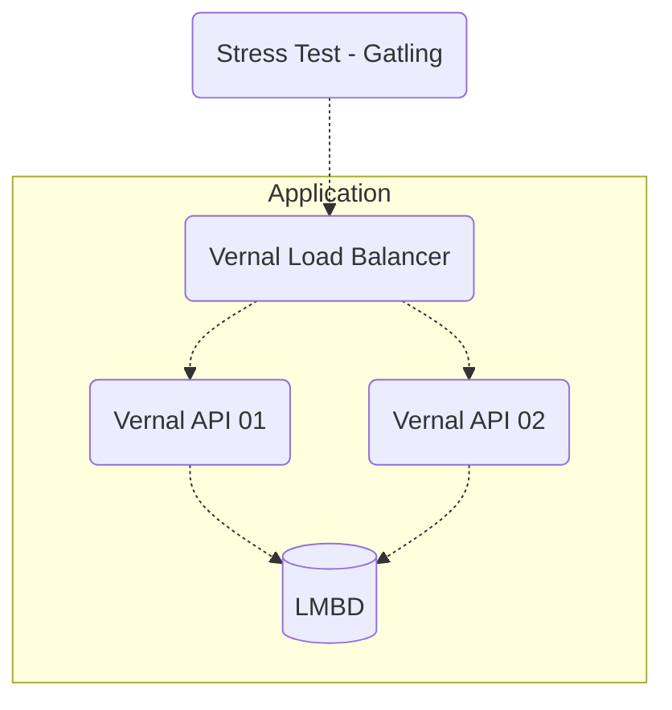

# :blossom:	Vernal

Vernal é minha proposta subatômica para a rinha de backend

O objetivo inicial foi criar uma solução tão leve quanto um neutrino.

## Visão Geral :eyes:

## Tecnologias utilizadas :sunglasses:

Tanto a API quanto o Load Balancer foram escritos em [Rust](https://www.rust-lang.org/) utilizando [Tokio](https://tokio.rs/) como runtime assincrono.  
O Banco de Dados utilizado foi o [Lightning Memory-Mapped Database Manager (LMDB)](https://www.symas.com/lmdb).

As aplicações foram compiladas estáticamente e as imagens dos containeres foram geradas a partir da base `SCRATCH`.

## Repositório do Projeto :octocat:

[https://github.com/richardnfag/vernal](https://github.com/richardnfag/vernal)

## Conecte-se comigo :grinning:	

https://www.linkedin.com/in/richardnfag

https://github.com/richardnfag

https://twitter.com/richardnfag

### Nota :alien:

    Isso jamais, em hipótese alguma, reflete um código real de produção. (Risos).
